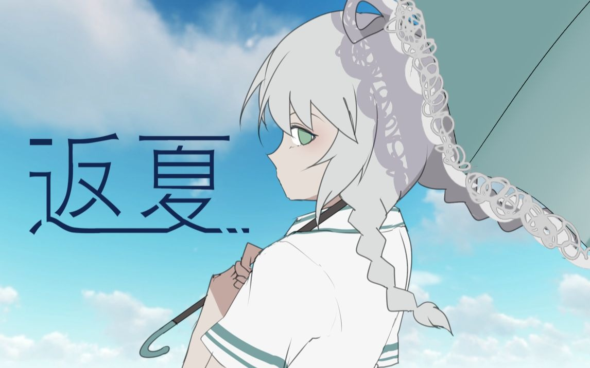
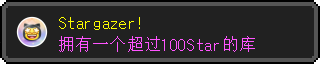

[![header]][home]
[![moe-counter]][home]

<a href="README.md">简体中文</a> | <b>English</b>

<h2>Visit my <a href="https://afdian.com/a/WJZ_P" rel="noreferrer">Afdian</a>
( ≧ω≦ )</h2>

<h1 align="center">Hi there! I'm WJZ_P, nice to meet you! 👋</h1>

  

<h2 align="center">"The summer of the year the wind said goodbye to me, the end of July. A blank letter and the setting sun fell together into the world beyond the mountains."</h2>
 

  
  
  
  
  
  
  

<h2 align="left">My current achievements:</h2>

 <a href="https://www.w3schools.com/css/" target="_blank" rel="noreferrer"> 

<h2 align="left">Languages and frameworks I use:</h2>

  
  
  
  
  
  
  
  
  
  
  

  

>

>

>

>
>

>

>

>

<h2 align="left">📦 My main projects:</h2>

  
  
  
  

  
  

  
  

  
  

  

<h2 align="left">🗺️ My contribution map:</h2>

  

  <em>Generated by <a href="https://github.com/WJZ-P/CommitCraft">CommitCraft</a> —— turning your GitHub contribution heatmap into a Minecraft-style isometric pixel world 🌍</em>

[home]: https://github.com/WJZ-P
[header]: https://capsule-render.vercel.app/api?type=Waving&color=timeGradient&height=140&text=WJZ_P&fontSize=45&fontFamily=sans&textColor=%23FFFFFF&border=5px%20solid%20%23000000&borderRadius=20&shadow=0px%200px%2010px%20rgba(0,0,0,0.5)
[moe-counter]: https://count.getloli.com/get/@WJZ-P?theme=rule34
